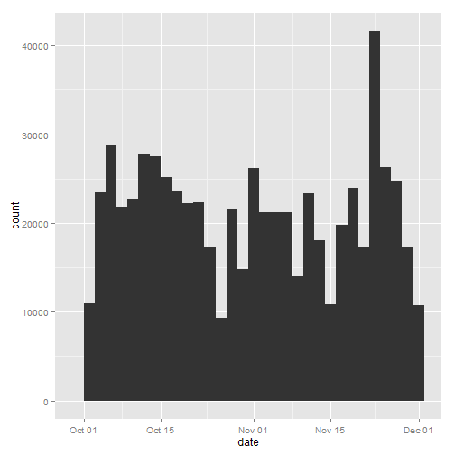

Loading and preprocessing the data


```r
activity <- read.csv("./activity.csv")
activity$date <- as.Date(activity$date)
head(activity)
```

```
##   steps       date interval
## 1    NA 2012-10-01        0
## 2    NA 2012-10-01        5
## 3    NA 2012-10-01       10
## 4    NA 2012-10-01       15
## 5    NA 2012-10-01       20
## 6    NA 2012-10-01       25
```

```r
summary(activity)
```

```
##      steps            date               interval   
##  Min.   :  0.0   Min.   :2012-10-01   Min.   :   0  
##  1st Qu.:  0.0   1st Qu.:2012-10-16   1st Qu.: 589  
##  Median :  0.0   Median :2012-10-31   Median :1178  
##  Mean   : 37.4   Mean   :2012-10-31   Mean   :1178  
##  3rd Qu.: 12.0   3rd Qu.:2012-11-15   3rd Qu.:1766  
##  Max.   :806.0   Max.   :2012-11-30   Max.   :2355  
##  NA's   :2304
```

What is mean total number of steps taken per day?

Histogram

```r
library(ggplot2)
stepsPlot<-qplot(date, weight=activity$steps, data=activity, geom="histogram")
print(stepsPlot)
```

```
## stat_bin: binwidth defaulted to range/30. Use 'binwidth = x' to adjust this.
```

 

Mean and Median

```r
mean(tapply(activity$steps, activity$date, sum, na.rm = TRUE))
```

```
## [1] 9354
```

```r
median(tapply(activity$steps, activity$date, sum, na.rm = TRUE))
```

```
## [1] 10395
```

What is the average daily activity pattern?

Average Number of Steps Plot 

```r
average_steps<-data.frame(cbind(activity$interval,tapply(activity$steps, activity$interval, mean, na.rm = TRUE)))
colnames(average_steps) <- c("interval","steps")
averageStepsPlot<-ggplot(data=average_steps,aes(x=interval,y=steps)) +
  geom_line()
print(averageStepsPlot)
```

 

Maximum Steps

```r
maxtime<-average_steps[which.max(average_steps$steps),"interval"]
strftime( as.POSIXct(Sys.Date()) + as.difftime(round(maxtime/100), units="hours")+ as.difftime(maxtime%%100, units="mins"), "%r",tz="UTC") 
```

```
## [1] "08:35:00 AM"
```

Imputing missing values

Missing Values

```r
sum(is.na(activity$steps))
```

```
## [1] 2304
```

Fixing Missing Values

```r
fixed<-activity
fixed[is.na(fixed[, 1]), 1]<-average_steps[is.na(fixed[, 1]),2]
```

Histogram

```r
qplot(date, weight=fixed$steps, data=fixed, geom="histogram")
```

```
## stat_bin: binwidth defaulted to range/30. Use 'binwidth = x' to adjust this.
```

 

Mean and Median

```r
mean(tapply(fixed$steps, fixed$date, sum, na.rm = TRUE))
```

```
## [1] 10766
```

```r
median(tapply(fixed$steps, fixed$date, sum, na.rm = TRUE))
```

```
## [1] 10766
```

Are there differences in activity patterns between weekdays and weekends?

Weekday and Weekend

```r
library(lattice)
fixed$day<-as.factor(ifelse(weekdays(fixed$date) %in% c("Saturday","Sunday"),"Weekend","Weekday"))
```

Average step for Weekday/Weekend Plot

```r
xyplot(steps ~ interval | day, aggregate(steps ~ interval + day, fixed, FUN = mean), layout = c(1, 2), type = "l", group=day)
```

 
